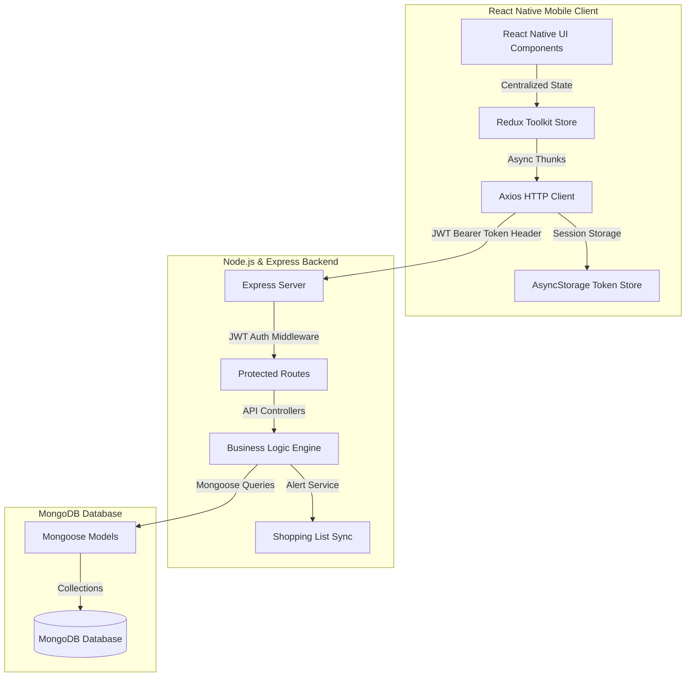

# 🛒 PantrySmart: Smart Grocery & Pantry Inventory Manager

**PantrySmart** is a robust, full-stack, cross-platform mobile application built using **React Native CLI and TypeScript** on the frontend, backed by a **Node.js, Express, and MongoDB** REST API. It is designed to help households, kitchens, and shared living spaces manage grocery stock, minimize food waste, track expiration dates, receive automated stock alerts, and dynamically synchronize shopping lists.

---

## 🚀 Key Features

*   **🔐 Secure Authentication & Session Persistence**: Token-based login, registration, and session restoration using JWT and `@react-native-async-storage/async-storage`.
*   **📦 Pantry Inventory CRUD**: Complete inventory tracking with product name, category, brand, quantity, unit type, minimum safety stock, purchase price, location (e.g. Fridge, Pantry), and customized text notes.
*   **⚡ Reactive Stepper Controls**: Rapid `[-]` Quantity `[+]` stepper inputs on inventory item cards to update pantry stock levels instantly.
*   **🔔 Automatic Low-Stock Alerts**: Background validation dynamically checks when stock falls below target minimum limits and logs unread notifications.
*   **🔄 Smart Shopping List Synchronization**: Automatically computes the required restock quantity using $\max(0.1, \text{Target Stock} - \text{Current Stock})$ where $\text{Target Stock} = 2 \times \text{Minimum Stock}$, automatically appending the item to the active buy list.
*   **🔄 Closed-Loop Restocking**: Checking off items in the shopping list automatically updates inventory stock levels and writes a transaction history log.
*   **⏳ Intelligent Expiry Tracking**: Computes days remaining until expiry and handles custom alarms (`EXPIRY_SOON`, `EXPIRED`).
*   **📊 Consumption Analysis & Restock Predictions**: Evaluates historical transaction logs over a 30-day window to determine daily average consumption and forecast estimated stock days remaining.
*   **📱 Simulated Hardware Integration**:
    *   *Barcode Scanner*: Simulated camera viewport with a laser animation to scan barcodes (e.g. Diet Coke) and auto-populate product creation forms.
    *   *Receipt OCR Scanner*: Simulates snapshot OCR processing to parse scanned items and bulk import new inventory items.
*   **👪 Real-Time Family Group Sharing**: Supports generating or joining family groups using unique invite codes to coordinate shared stock levels and shopping list updates across multiple user devices.
*   **📈 Advanced Analytics & Dashboard Insights**: High-fidelity dashboard widgets rendering total inventory value, item stock distribution, categorical valuations, spending history, and stock activity logs.

---

## 📐 System Architecture & Data Flow



### 🗺️ Screen Navigation Architecture

The mobile app implements type-safe navigation via React Navigation v7 with a structured layout:

```text
RootNavigator
├── AuthNavigator (Unauthenticated Stack)
│   ├── Login (LoginScreen)
│   └── Register (RegisterScreen)
│
└── Main (Authenticated Bottom Tab Navigator)
    ├── DashboardTab (DashboardScreen)
    ├── InventoryTab (InventoryScreen)
    ├── ShoppingListTab (ShoppingListScreen)
    ├── AnalyticsTab (AnalyticsScreen)
    └── ProfileTab (ProfileScreen)
    │
    └── Actions Stack (Overlaying Main Navigator)
        ├── AddGrocery (AddGroceryScreen)
        ├── GroceryDetails (GroceryDetailsScreen)
        ├── EditGrocery (EditGroceryScreen)
        └── Scanner (ScannerScreen)
```

---

## 🗄️ Database Schema Design (Mongoose Models)

### 1. User Schema ([User.js](file:///d:/AppDev/Smart-Grocery-List-Inventory-Management/server/models/User.js))
Tracks user details, profile pictures, and family association. Password hashing is automated using a pre-save Mongoose hook.
```javascript
{
  name: { type: String, required: true },
  email: { type: String, required: true, unique: true },
  password: { type: String, required: true }, // Hashed via bcryptjs
  phone: { type: String, default: '' },
  profileImage: { type: String, default: '' },
  familyId: { type: ObjectId, ref: 'Family', default: null }
}
```

### 2. Grocery Schema ([Grocery.js](file:///d:/AppDev/Smart-Grocery-List-Inventory-Management/server/models/Grocery.js))
Stores inventory items. Uses compound indexing for performance optimizations.
```javascript
{
  userId: { type: ObjectId, ref: 'User', required: true },
  name: { type: String, required: true },
  category: { 
    type: String, 
    enum: ['Vegetables', 'Fruits', 'Dairy', 'Grains', 'Snacks', 'Beverages', 'Meat', 'Frozen', 'Household', 'Other'], 
    default: 'Other' 
  },
  brand: { type: String, default: '' },
  quantity: { type: Number, default: 0 },
  unit: { type: String, default: 'pcs' },
  minimumStock: { type: Number, default: 0 },
  purchasePrice: { type: Number, default: 0 },
  expiryDate: { type: Date, default: null },
  barcode: { type: String, default: '' },
  location: { type: String, default: '' }, // Fridge, Pantry, Freezer, Cabinet
  notes: { type: String, default: '' }
}
// Indexes: { userId: 1, category: 1 }, { userId: 1, barcode: 1 }
```

### 3. ShoppingList Schema ([ShoppingList.js](file:///d:/AppDev/Smart-Grocery-List-Inventory-Management/server/models/ShoppingList.js))
Maintains buy lists of items to purchase.
```javascript
{
  userId: { type: ObjectId, ref: 'User', required: true },
  name: { type: String, default: 'My Shopping List' },
  items: [{
    itemId: { type: ObjectId, ref: 'Grocery', default: null },
    name: { type: String, required: true },
    quantity: { type: Number, default: 1 },
    unit: { type: String, default: 'pcs' },
    completed: { type: Boolean, default: false }
  }],
  status: { type: String, enum: ['active', 'archived'], default: 'active' },
  shared: { type: Boolean, default: false }
}
```

### 4. Transaction Schema ([Transaction.js](file:///d:/AppDev/Smart-Grocery-List-Inventory-Management/server/models/Transaction.js))
Maintains transaction histories for stock adjustments (PURCHASE, CONSUMPTION, ADJUSTMENT, WASTE, etc.).
```javascript
{
  userId: { type: ObjectId, ref: 'User', required: true },
  groceryItemId: { type: ObjectId, ref: 'Grocery', required: true },
  type: { type: String, enum: ['PURCHASE', 'CONSUMPTION', 'ADJUSTMENT', 'WASTE'], required: true },
  quantity: { type: Number, required: true },
  reason: { type: String, default: '' }
}
```

### 5. Notification Schema ([Notification.js](file:///d:/AppDev/Smart-Grocery-List-Inventory-Management/server/models/Notification.js))
Stores system alerts for inventory status warnings.
```javascript
{
  userId: { type: ObjectId, ref: 'User', required: true },
  type: { type: String, enum: ['LOW_STOCK', 'EXPIRY_SOON', 'EXPIRED', 'RESTOCK'], required: true },
  title: { type: String, required: true },
  message: { type: String, required: true },
  relatedItemId: { type: ObjectId, ref: 'Grocery', default: null },
  read: { type: Boolean, default: false }
}
// Index: { userId: 1, read: 1 }
```

### 6. Family Schema ([Family.js](file:///d:/AppDev/Smart-Grocery-List-Inventory-Management/server/models/Family.js))
Stores family groups for shared pantries.
```javascript
{
  name: { type: String, required: true },
  ownerId: { type: ObjectId, ref: 'User', required: true },
  members: [{ type: ObjectId, ref: 'User' }]
}
```

---

## 📡 REST API Reference

All requests and responses use JSON formatting. Except for Registration and Login, all endpoints require a `Authorization: Bearer <JWT_TOKEN>` header.

### 🔐 Authentication & Family Group Endpoints
| HTTP Method | Route | Description | Protected | Request Body Parameters |
| :--- | :--- | :--- | :--- | :--- |
| `POST` | `/api/auth/register` | Register a new user | No | `name`, `email`, `password`, `phone` (optional) |
| `POST` | `/api/auth/login` | Login and get JWT | No | `email`, `password` |
| `GET` | `/api/auth/me` | Fetch active user profile | Yes | None |
| `POST` | `/api/auth/family/create` | Create a family sharing group | Yes | `name` |
| `POST` | `/api/auth/family/join` | Join a family group | Yes | `familyId` |
| `GET` | `/api/auth/family/:familyId` | Fetch family group members | Yes | None |

### 📦 Pantry Inventory Endpoints
| HTTP Method | Route | Description | Protected | Request Query / Body Parameters |
| :--- | :--- | :--- | :--- | :--- |
| `GET` | `/api/inventory` | Retrieve inventory list | Yes | Query: `search`, `category`, `filter` (`lowStock`, `expiringSoon`, `expired`, `available`, `outOfStock`), `sort` |
| `POST` | `/api/inventory` | Add an inventory item | Yes | Body: `name`, `category`, `brand`, `quantity`, `unit`, `minimumStock`, `purchasePrice`, `expiryDate`, `barcode`, `location`, `notes` |
| `GET` | `/api/inventory/:id` | Fetch specific item details | Yes | None |
| `PUT` | `/api/inventory/:id` | Update item properties | Yes | Body: Updatable fields |
| `DELETE` | `/api/inventory/:id` | Remove item | Yes | None |
| `POST` | `/api/inventory/:id/consume` | Record stock consumption | Yes | Body: `amount` (number), `reason` (string, e.g. "waste") |
| `POST` | `/api/inventory/:id/purchase` | Log replacement purchase | Yes | Body: `amount` (number), `price` (number, optional) |
| `GET` | `/api/inventory/:id/history` | Fetch item transaction log | Yes | None |

### 🛒 Shopping List Endpoints
| HTTP Method | Route | Description | Protected | Request Body Parameters |
| :--- | :--- | :--- | :--- | :--- |
| `GET` | `/api/shopping-lists` | Fetch active shopping list | Yes | None |
| `POST` | `/api/shopping-lists/items`| Add manual item | Yes | `name`, `quantity`, `unit`, `itemId` (optional) |
| `PUT` | `/api/shopping-lists/items/:itemId` | Update quantity / toggle complete | Yes | `quantity`, `completed` |
| `DELETE`| `/api/shopping-lists/items/:itemId`| Delete item | Yes | None |

### 📊 Dashboard & Analytical Endpoints
| HTTP Method | Route | Description | Protected | Request Body Parameters |
| :--- | :--- | :--- | :--- | :--- |
| `GET` | `/api/dashboard/summary` | Fetch KPIs (low stock, values) | Yes | None |
| `GET` | `/api/dashboard/analytics` | Fetch metrics charts data | Yes | None |
| `GET` | `/api/dashboard/restock-predictions` | Run consumption forecast | Yes | None |

### 🔔 Notifications Endpoints
| HTTP Method | Route | Description | Protected | Request Body Parameters |
| :--- | :--- | :--- | :--- | :--- |
| `GET` | `/api/notifications` | Fetch unread system notifications | Yes | None |
| `PUT` | `/api/notifications/:id/read` | Mark notification as read | Yes | None |

---

## 🧮 Business Logic Equations

### 1. Smart Restock Quantity Calculation
When a pantry item falls below its `minimumStock` limit, the alert engine calculates the restock requirements:
$$\text{Restock Quantity} = \max(0.1, \text{Target Stock} - \text{Current Stock})$$
$$\text{Target Stock} = 2 \times \text{Minimum Stock}$$

### 2. Days Until Expiry Warning
Days remaining are calculated dynamically:
$$\text{Days Remaining} = \left\lceil \frac{\text{Expiry Date} - \text{Current Time}}{1000 \times 60 \times 60 \times 24} \right\rceil$$
$$\text{Warning Status} = \begin{cases}
  \text{EXPIRY\_SOON} & \text{if } 0 \le \text{Days Remaining} \le 3 \\
  \text{EXPIRED} & \text{if } \text{Days Remaining} < 0
\end{cases}$$

### 3. Consumption Predictions & Days Remaining
Uses transactions recorded in the last 30 days to calculate:
$$\text{Average Daily Consumption} = \frac{\sum \text{Consumption Quantities}}{\text{Date of Last Log} - \text{Date of First Log} \text{ (in days)}}$$
$$\text{Days of Stock Remaining} = \frac{\text{Current Stock Quantity}}{\text{Average Daily Consumption}}$$

---

## 🛠️ Installation & Setup

### Prerequisites
*   **Node.js**: `v22.11.0` or higher
*   **MongoDB**: Local database running on default port `27017` OR a MongoDB Atlas cloud URI
*   **Android SDK & Studio**: Build tools, SDK Platform 34+, emulator configured for development
*   **Java SE Development Kit (JDK)**: v17 configured in environment variables

### Step 1: Workspace Setup
Clone the project repository:
```bash
git clone <repository-url> smart-grocery-list
cd smart-grocery-list
```

### Step 2: Configure & Start Express Backend
1.  Navigate to the server directory:
    ```bash
    cd server
    ```
2.  Install dependencies:
    ```bash
    npm install
    ```
3.  Create a `.env` configuration file:
    ```env
    PORT=5000
    MONGO_URI=mongodb://127.0.0.1:27017/smart_grocery_db
    JWT_SECRET=supersecretjwtkey_smartgrocery_123456
    ```
    > [!TIP]
    > You can copy from the root `.env.example` to quickly populate configuration settings.
4.  Run in hot-reload development mode:
    ```bash
    npm run dev
    ```
    The server console should output: `MongoDB Connected: 127.0.0.1` and `Server running in development mode on port 5000`.

### Step 3: Configure & Start Mobile App
1.  Open a new terminal session and navigate to the mobile folder:
    ```bash
    cd mobile
    ```
2.  Install node modules:
    ```bash
    npm install
    ```
3.  Verify server connection parameters:
    Open [`mobile/src/constants/index.ts`](file:///d:/AppDev/Smart-Grocery-List-Inventory-Management/mobile/src/constants/index.ts).
    *   **Android Emulator**: Ensure you configured connection target to default gateway IP `http://10.0.2.2:5000/api` or local machine IP since `localhost` loops inside the Android environment.
    *   **iOS Simulator**: Leave target set to `http://localhost:5000/api`.
    *   **Physical Mobile Device**: Change target to your machine's Local Area Network Wi-Fi IP (e.g. `http://192.168.1.15:5000/api`) and ensure both host computer and phone share the same network.
4.  Start the Metro Bundler package manager:
    ```bash
    npx react-native start
    ```
5.  Build and deploy the application:
    ```bash
    npx react-native run-android
    ```

---

## ☁️ Vercel Deployment (Backend)

The Express backend is pre-configured to be deployed as serverless functions on Vercel. 

### Step 1: Create a Vercel Project
1. Log in to your [Vercel Dashboard](https://vercel.com).
2. Click **Add New** > **Project** and import your Git repository.

### Step 2: Configure Project Settings
In the Vercel project configuration setup, configure the following settings:
*   **Framework Preset**: Select **Other**.
*   **Root Directory**: Set this to `server`. Vercel will focus entirely on building and running the Express server code located in the `/server` folder.

### Step 3: Add Environment Variables
Expand the **Environment Variables** accordion and add the following keys:
*   `MONGO_URI`: Your MongoDB connection URI (e.g. MongoDB Atlas connection string `mongodb+srv://...`).
*   `JWT_SECRET`: A long secure secret key used to sign and authenticate JWT tokens.
*   `NODE_ENV`: Set this to `production` so database connection optimization handles errors correctly.

### Step 4: Deploy
Click **Deploy**. Vercel will automatically build the backend, read the `vercel.json` routing rules, and expose a public URL (e.g., `https://your-project.vercel.app/api/health`).

> [!IMPORTANT]
> Once deployed, make sure to update the `API_BASE_URL` in the React Native client ([`mobile/src/constants/index.ts`](file:///d:/AppDev/Smart-Grocery-List-Inventory-Management/mobile/src/constants/index.ts)) to match your new Vercel deployment URL (e.g., `https://your-project.vercel.app/api`).

---

## 🧠 Learning Outcomes & Architectural Lessons

1.  **Event-Driven Sync Cycles**: Synchronizing clients and servers using closed-loop database handlers (checking a shopping item completes backend state hooks, increments stock, and writes logs).
2.  **Centralized HTTP Interceptors**: Leveraging Axios request interceptors to automatically fetch tokens from `AsyncStorage` and append auth headers.
3.  **Mongoose Performance Indexing**: Writing complex schemas utilizing compound indexes to maximize database lookups.
4.  **Type Safety on Navigation Stack**: Implementing parameter mappings to validate transitions compile-time and block type mismatch errors.
5.  **State Slice Decoupling**: Segmenting global states (auth, inventory, shopping list, notifications) with Redux Toolkit for atomic UI updates.
6.  **Responsive Vector Graphics**: Implementing scalable inline SVG models inside CLI configurations, avoiding compilation errors and packaging overhead.
